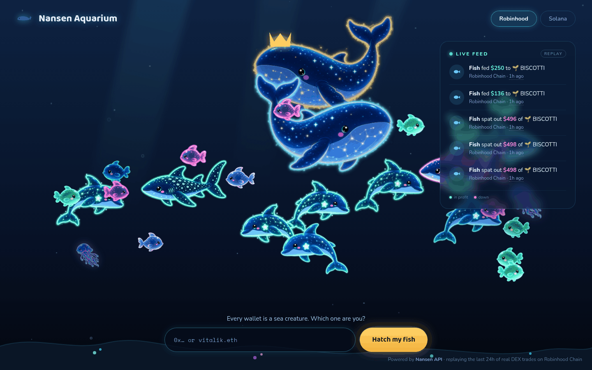
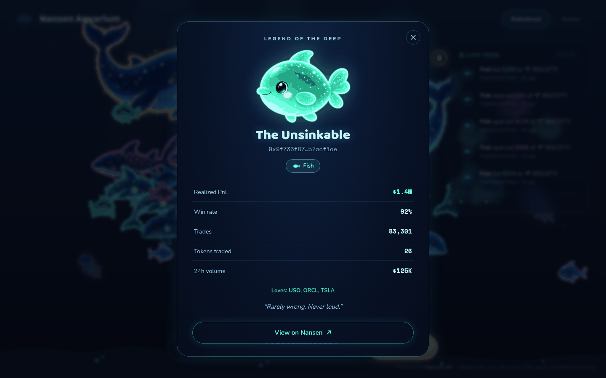
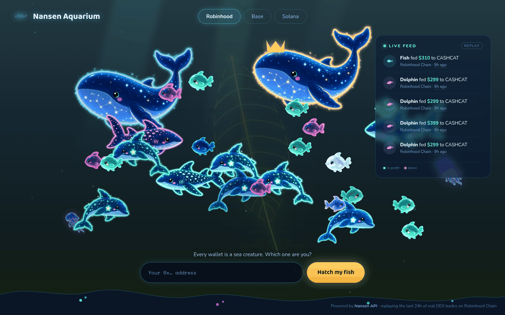

# Nansen Aquarium

A deep-sea aquarium where the top onchain traders swim as glowing creatures.



## Concept

Wallet analytics usually arrive as a table: address, volume, PnL, win rate. The
Aquarium reads the same numbers and paints them instead. Every day it picks the
five busiest tokens on a chain, finds the wallets moving the most size in them,
and turns each one into a bioluminescent creature — its species set by how much
it moves, its brightness by how often it is right, its colour by whether it is
up or down. The feed panel replays those wallets' real trades from the last 24
hours as the creature swims. Click one and it tells you its story.

## The two tanks

| Tab | Chain | What swims there |
| --- | --- | --- |
| **Robinhood** (default) | Robinhood Chain | Tokenized equities — NVDA, SPCX, TSLA, ORCL — alongside the chain's native memes |
| **Solana** | Solana | Launchpad tokens and the memecoin flow around them |

Two chains, two entirely different crowds, same rules. Switching tabs drains the
tank and refills it from that chain's own snapshot — new tokens, new residents,
new trades. Both are read through the same generic pipeline, so a third chain is
one entry in [`src/chains.js`](src/chains.js) and one `npm run fetch <chain>`.

## Features

- **A living tank.** 25 wallets swim with separation steering, depth bands and
  per-species speed. Nothing is placed by hand; the layout falls out of the data.
- **Legend of the Deep.** Click a creature for a biography card — an epithet
  earned from its own stats ("The Unsinkable", "The Gambler", "The Deep Pocket"),
  its realized PnL, win rate, trade count and favourite tokens.
- **Trade replay.** The feed panel replays the last 24 hours of real DEX trades
  in order. Each event sends a coin arcing to the wallet that made it; wallets
  not currently in the tank swim past as anonymous guests. Every row's timestamp
  links to that transaction on its own chain's block explorer.
- **Hand-painted sprites.** Fourteen WebP creatures across four species and three
  colourways, with the glow baked into the art and exposure driven by the data.
- **No build step, no dependencies.** Plain ES modules, one stylesheet, a Node
  stdlib dev server. Clone and open.

## How it works

Each visual property is a direct reading of one field:

| What you see | Where it comes from | Mapping |
| --- | --- | --- |
| Which tokens | `token-screener`, 24h volume | Top 5 by volume, minus stablecoins and wrapped natives |
| Who is in the tank | `tgm/who-bought-sold` → `trade_volume_usd` | Top 25 traders, summed across the five tokens |
| Species | `trades_24h_usd` rank within the tank | Top 2 whale, next 3 shark, next 6 dolphin, rest fish |
| Size | `trades_24h_usd` | Log-normalized to 0.3–1.0 across the tank |
| Brightness | `win_rate` | `brightness()` 0.90 → 1.15, breathing ±0.08 |
| Glow colour | sign of `realized_pnl_usd` | Mint when up, rose / magenta / pink when down, blue-cyan when unknown |
| Gold crown | highest `trades_24h_usd` | One per tank, pinned to the gold whale |
| Epithet | `win_rate`, `realized_pnl_usd`, `traded_times`, `traded_token_count` | First matching rule names the wallet |
| Feed row | one `tgm/dex-trades` row | Direction, USD size, token symbol, age |

Creatures are identified by address only — the aquarium stores and shows no
Nansen entity labels, so a wallet's species is earned purely by the size it
moved in the tank today.

## Quick start

```bash
git clone https://github.com/SaxophoneTrom/nansen-aquarium.git
cd nansen-aquarium
npm run dev            # http://localhost:8787
```

The repository ships with a data snapshot, so the tank works immediately with no
API key.

To pull fresh data you need a [Nansen API](https://app.nansen.ai/smart-money?ref=saxo55) key:

```bash
echo 'NANSEN_API_KEY=your_key_here' > .env   # gitignored
npm run fetch robinhood                      # full refresh: tank + feed
npm run fetch solana
npm run fetch:feed robinhood                 # feed only, cheaper
```

The chain argument is any chain id the Nansen API knows; it names both the
request and the `public/data/<chain>/` folder it writes. It defaults to
`robinhood`.

`NANSEN_API_KEY` is read from the environment, so `NANSEN_API_KEY=… npm run
fetch` works too — useful in CI, where the key comes from a repository secret.

Requires Node 20.18+ (22+ recommended). There is nothing to install.

## Data pipeline & credits

`scripts/fetch.mjs` runs four steps and writes two JSON files:

| Step | Endpoint | Calls | Credits |
| --- | --- | --- | --- |
| Cast the tokens | `token-screener` | 1 | 1 |
| Feed | `tgm/dex-trades` | 5, one per token | 5 |
| Roster | `tgm/who-bought-sold` | 5, one per token | 5 |
| Enrichment | `profiler/address/pnl-summary` | 25, one per creature | 25 |

A full run costs **36 credits** per chain. A feed-only run replays the same five
tokens already recorded in `tank.json`, so it skips the screener and costs **5**.
The shipped schedule is four feed runs and one full run a day on each of the two
chains — **112 credits a day**.

Trades under $100 are dropped as dust. The feed merges each fetch with the
previous `feed.json` and trims to a rolling 24-hour window capped at 600 events,
so a single call that returns a short slice of the day still leaves a full panel
on screen.

Two details make the pipeline chain-agnostic rather than EVM-only. Addresses are
folded to lower case only when they are actually hex, because a Solana address is
base58 and case-sensitive. And if `tgm/who-bought-sold` comes back thin on a
chain, the roster is topped up from the `tgm/dex-trades` rows already fetched —
summing `estimated_value_usd` per `trader_address` — which costs nothing extra.

Output lands in `public/data/<chain>/` — `robinhood/` and `solana/` ship with the
repository:

- `tank.json` — the five tokens, plus 25 creatures with species, size, win rate, realized PnL, top tokens
- `feed.json` — the rolling 24h event list the replay reads

### Redistribution compliance

Every endpoint this project calls is in the ✅ **Allowed** tier of Nansen's
[Data Redistribution Guidelines](https://docs.nansen.ai/guides/redistribution-guide):
`token-screener`, `tgm/who-bought-sold` and `tgm/dex-trades` are allowed with
attribution, and `profiler/address/pnl-summary` is allowed with no further
requirement. Attribution is carried in the app footer and below.

Nothing here touches the `smart-money/*` or `address/labels` endpoints, no
request sets `only_smart_money` or `include_smart_money_labels`, and no Nansen
label is stored in `public/data/` or rendered in the UI.

## Architecture

```
index.html              markup, ambient background layers, UI shell
styles.css              every visual token, animation and layout rule
src/
  main.js               boot: load JSON, wire tank + feed + replay + modal
  chains.js             the chain registry — tab label, explorer, address shape
  tank.js               creature bodies, steering, depth bands, hover chip
  sprites.js            species table, sprite variants, crown, inline SVG chrome
  feed.js               feed panel rows and USD formatting
  events.js             trade replay — coin arcs, guest walk-ons
  legend.js             "Legend of the Deep" biography modal and epithet rules
scripts/
  fetch.mjs             Nansen API → public/data/<chain>/*.json
  serve.mjs             static dev server, Node stdlib only
  prepare_sprites.py    art masters → baked WebP sprites
public/
  sprites/              14 WebP creatures
  data/robinhood/       tank.json, feed.json
  data/solana/          tank.json, feed.json
```

The art masters are kept outside the repository; the baked WebP sprites in
`public/sprites/` are the shipped assets.

## Screenshots

| Legend of the Deep | Every colourway |
| --- | --- |
|  |  |

## Credits

Built for the **Nansen API Builder Campaign**.

Powered by [Nansen API](https://app.nansen.ai/smart-money?ref=saxo55). Blockchain
analytics data provided by [Nansen](https://nansen.ai/).

## License

[MIT](LICENSE) © 2026 saxophone55
